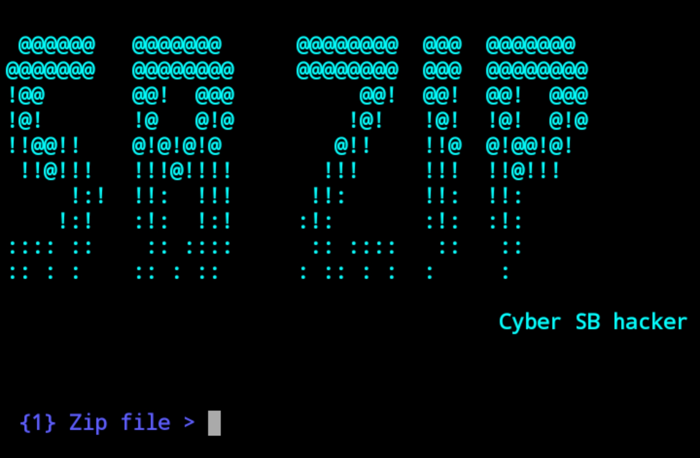

<h1 align="center">SB-zip v1.0</h1>

# SB-zip
Crack zip files password.

# Tested on
- Kali Linux
- Ubuntu
- Termux

# Installation
$ apt install python

$ apt install git

$ git clone https://github.com/SBHacker79/Sb-zip.git

$ cd SB-zip

$ python SB zip.py

$ /sdcard/enter zip file name

$ sdcard/enter password list file name

Type `help` for more information.

# Warning
***This tool is only for educational purpose. We are not responsible for any misuse or illegal activities.***
